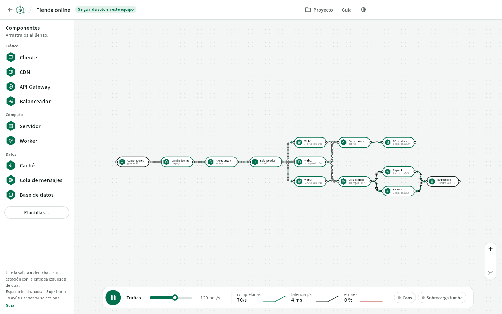

# DistiNode · app de escritorio y móvil

Versión **local** de DistiNode hecha en Flutter, para **Windows, Linux y Android**. Tiene todas las funciones de
la web para diseñar y simular, pero **sin cuentas, sin servidor y sin conexión**: los proyectos se guardan como
archivos en tu equipo.



## Qué incluye

- **Mis proyectos** (sustituye a «Mis salas»): crear, abrir, renombrar, duplicar, borrar, guardar como archivo e
  importar. Cada proyecto se guarda solo mientras trabajas.
- **Lienzo de metro**: los 9 componentes (Cliente, CDN, API Gateway, Balanceador, Servidor, Worker, Caché, Cola
  de mensajes y Base de datos), arrastrar desde la paleta o pulsar para añadir, conectar arrastrando de la salida ●
  a la entrada, mover, seleccionar varios (Mayús + clic o rectángulo con Mayús + arrastrar), borrar, zoom y
  encuadre.
- **El mismo motor de simulación** que la web, portado a Dart línea a línea y validado con las mismas pruebas:
  colas, saturación verde → ámbar → rojo, tiempos de espera, reintentos con espera exponencial, límite de ritmo,
  trabajo asíncrono con reentrega, fan-out, latencia de red y trenes animados.
- **Métricas en vivo** con minigráficas del último minuto: completadas/s, latencia p95, errores, reintentos y
  trabajo en segundo plano.
- **Fallos**: tumbar, degradar y cortar conexiones; modos **Caos** y **Sobrecarga tumba** con reinicio automático
  y cuenta atrás.
- **14 plantillas** (patrones y sistemas reales) con miniatura de metro.
- **Exportar imagen PNG** del diagrama completo con franja de marca, nombre y fecha.
- **Archivos `.distinode.json` compatibles con la web**: lo que guardas aquí se abre allí y al revés.
- **Guía completa** dentro de la app (componentes, métricas, fallos, plantillas, retos y glosario). El «?» del
  panel de propiedades salta al componente.
- **Modo claro y oscuro** (se recuerda), y diseño adaptado a móvil: botón + para añadir, propiedades en hoja
  inferior, «Conectar con…» sin arrastrar y pellizco para hacer zoom.

### Lo que no está (a propósito)

Lo que dependía de cuentas y del servidor: inicio de sesión (Supabase), salas compartidas, cursores y avisos en
tiempo real (Liveblocks). Para compartir un diseño, guárdalo como archivo.

## Instalar

Descarga la última versión desde **[Releases](https://github.com/AndyCG03/web-sistemas-distribuidos/releases)**.

| Sistema | Archivo | Cómo |
| --- | --- | --- |
| Windows 10/11 (64 bits) | `DistiNode-x.y.z-windows-x64-setup.exe` | Ejecútalo y sigue el asistente. No pide permisos de administrador. |
| Windows (sin instalar) | `DistiNode-x.y.z-windows-x64-portable.zip` | Descomprime y abre `distinode.exe`. |
| Ubuntu / Debian / Mint | `DistiNode-x.y.z-linux-amd64.deb` | `sudo apt install ./DistiNode-x.y.z-linux-amd64.deb` |
| Otras distribuciones Linux | `DistiNode-x.y.z-linux-x64.tar.gz` | Descomprime y ejecuta `DistiNode/distinode` (necesita GTK 3). |
| Android 7.0 o superior | `DistiNode-x.y.z-android.apk` | Ábrelo en el móvil y permite «instalar apps de origen desconocido». |

Windows SmartScreen puede avisar porque el instalador no está firmado con un certificado comercial: pulsa
«Más información» → «Ejecutar de todas formas».

### Dónde se guardan los proyectos

- **Windows**: `Documentos\DistiNode\Proyectos` (botón «Abrir carpeta» en Mis proyectos).
- **Linux**: `~/Documents/DistiNode/Proyectos` (o la carpeta de documentos de tu idioma).
- **Android**: dentro de la app. Usa «Compartir archivo» para sacarlos (Drive, correo, Archivos…).

Desinstalar la app no borra los proyectos.

## Atajos de teclado

| Tecla | Acción |
| --- | --- |
| Espacio | Poner en marcha / pausar |
| Supr o Retroceso | Borrar lo seleccionado |
| Esc | Quitar la selección |
| Ctrl+A | Seleccionar todos los componentes |
| Mayús + clic · Mayús + arrastrar | Añadir a la selección · rectángulo de selección |
| + · − · 0 | Acercar · alejar · encuadrar todo |
| Ctrl+S · Ctrl+E · Ctrl+O | Guardar como archivo · exportar imagen · importar proyecto |

## Desarrollo

Requisitos: Flutter 3.38 (Dart 3.10). Para Windows, Visual Studio Build Tools con C++; para Linux,
`clang cmake ninja-build pkg-config libgtk-3-dev`; para Android, Android SDK y JDK 17+.

```bash
cd app
flutter pub get
flutter run -d windows        # o: -d linux · -d <móvil>
flutter test --exclude-tags capturas
flutter analyze
```

### Estructura

```
lib/
  sim/          motor de simulación (Dart puro): components, engine, templates, rng, types
  model/        datos del diagrama y formato de archivo .distinode.json (compatible con la web)
  store/        estado del proyecto abierto y repositorio de proyectos en disco
  editor/       lienzo (pintado con Canvas), barra de simulación, propiedades, paleta, supervisor de fallos,
                exportación PNG y archivos
  home/         Mis proyectos
  guide/        guía
  theme/        tokens de color (los mismos de la web), tipografía Source Sans 3
  widgets/      iconos, logo, botones, plantillas
test/           pruebas del motor (port de Vitest), de plantillas y proyectos, y de la interfaz
tool/           generador de plantillas e iconos, scripts de empaquetado
installer/      instalador de Windows (Inno Setup) y entrada de escritorio de Linux
```

### Compilar los paquetes

```powershell
# Windows: instalador .exe + ZIP portable en build/installer/
powershell -ExecutionPolicy Bypass -File tool\build_windows.ps1
```

```bash
# Linux (en Linux): .deb + .tar.gz en build/installer/
flutter build linux --release && bash tool/package_linux.sh

# Android: APK universal
flutter build apk --release
```

Firma de Android: si existe `android/key.properties` (no se sube al repositorio) se firma con esa clave; si no,
con la de depuración. Formato:

```properties
storePassword=…
keyPassword=…
keyAlias=distinode
storeFile=C:/ruta/a/distinode-release.jks
```

Al publicar un release en GitHub, el workflow `.github/workflows/app.yml` compila Linux (`.deb` y `.tar.gz`) y
Android (`.apk`) y los adjunta al release. Desde la pestaña Actions («Run workflow») también genera los tres
sistemas como artefactos de prueba. En CI, el APK se firma con la clave de los secretos `ANDROID_KEYSTORE_BASE64`
y `ANDROID_KEYSTORE_PASSWORD` si existen; si no, con una clave de depuración.

### Mantener el motor sincronizado con la web

`lib/sim/` es una traducción fiel de `src/sim/`. Si cambia el motor de la web, aplica el mismo cambio aquí y
ejecuta las pruebas (`test/engine_test.dart` y `test/templates_project_test.dart` son las mismas de Vitest). Las
plantillas se regeneran desde la web con `python tool/gen_templates.py ..`.

Capturas para la documentación: `flutter test --update-goldens --tags capturas` (se guardan en `test/capturas/`).
